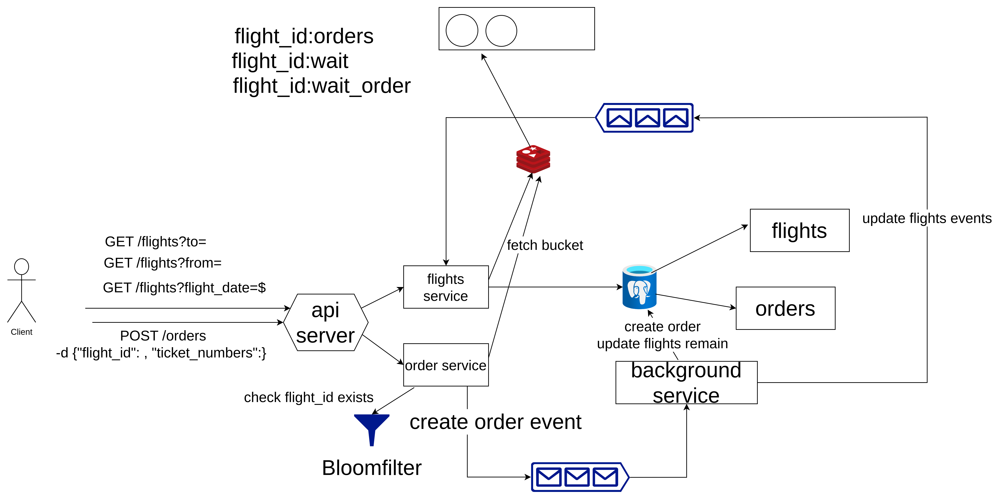
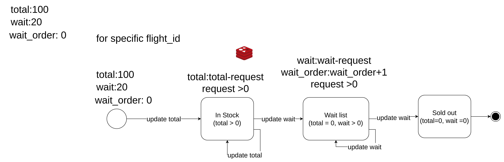

# airline-order-system

## 題目

設計特定航空的訂機票的功能，規格：

1. 可以按照起點、目的地、日期查詢班機狀態
2. 採取分頁方式返回可用班機清單、價格以及剩餘機位
3. 航空公司有超賣的慣例，功能也需要考量到超賣的情境
4. 設計表結構和索引、編寫主要程式碼、考慮大流量高並發情況(可以使用虛擬碼實現)。

## 交付時限/方式

- [ ]  題目送出後 7 天內
- [ ]  交付方式不限，可以是 Github, 也可以是 PDF. 

## schema design

https://dbdiagram.io/d/airline-order-system-66798c579939893dae1e006b


## 架構圖



## 針對某個 flight 航班 id 所做的狀態圖



## 使用 goose 做 migration

```shell
go install github.com/pressly/goose/v3/cmd/goose@latest
```

## 加註超賣說明

這邊解決的超賣是指 航空公司為了避免空機位造成空機位所以設定的

假設是總機位是 100 人，載客率是80%，所以會超賣 20 位置

所以 total = 100, wait = 20

然後為了保證完整性

所以當下單時，整個 Order 具有原子性，也就是要不出全部是候補機位，要不就是全部是搶到機位

這個系統保證當超過 120 以上時，就搶不到，但可以保證在 120 內順位時，一定可以搶到票