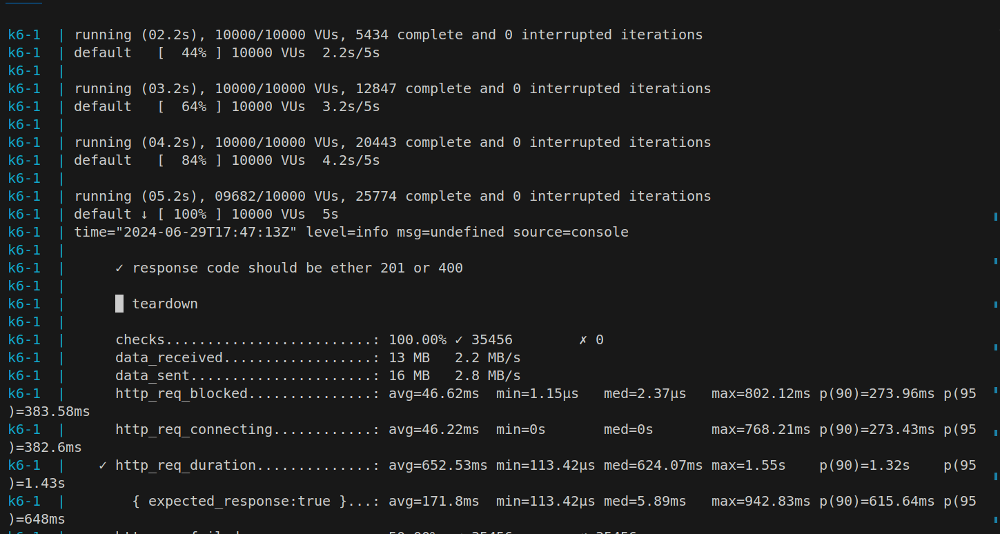

# k6 測試

目前測試在 10000 VU 的狀況下，能夠把回應時間維持在 1500ms 內

並且能夠順利把所有單的狀態透過 rabbitmq 消峰，以及限制在 1 consumer , 1 publisher 狀態把機票下單狀態寫入 DB

## 測試 script

```js
import http from 'k6/http';
import { check } from 'k6';
// 已建立好的 flight_id
const flight_ids = ["2e0933c1-2aed-4fe3-879f-0e3f8e01c282","687a96c2-4315-45f0-937c-03a16a1e156e"]
export const options = {
  thresholds: {
    // http_req_failed: ['rate<0.01'], // http errors should be less than 1%
    http_req_duration: ['p(95)< 1500'], // 95% of requests should be below 1500ms
  },
};
export default function () {
  // 隨機取一組 flight_id
  const idx = Math.random() >= 0.5? 1: 0;
  const flight_id = flight_ids[idx];
  const ticket_numbers = Math.floor(Math.random()*10)+1;
  const data = {flight_id, ticket_numbers};
  const params = {
    headers: {
      'Content-Type': 'application/json',
    },
  };
  const body = JSON.stringify(data)
  // 測試下單功能
  const res = http.post("http://localhost:8000/orders", body, params)
  check(res , {
    'response code should be ether 201 or 400': (res) => res.code == 201 || res.code == 400,
  })
}

export function teardown(data) {
  console.log(JSON.stringify(data));
}
```

## 測試 report

